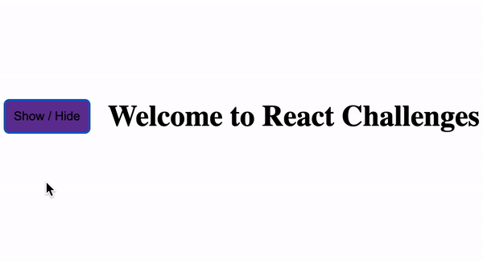
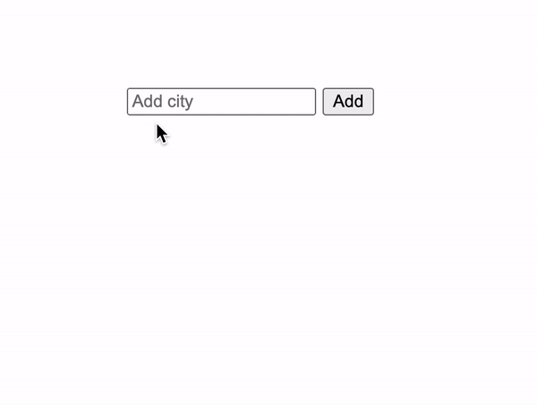

### Challenge: Show/Hide Title

In this challenge, you will create a component called `ShowHide.jsx` that toggles the visibility of a title when a button is clicked. The button text should change based on the visibility of the title.

#### Requirements:
1. The button should display "Hide" when the title is visible.
2. The button should display "Show" when the title is hidden.
3. Clicking the button should toggle the visibility of the title.

### Challenge: ToDo List

In this challenge, you will create a ToDo list component called `ToDoList.jsx` that allows users to add and remove items from a list.

#### Requirements:
1. There should be a text input where users can type the name of a new ToDo item.
2. There should be an "Add" button that adds the new item to the list.
3. The list should display all ToDo items.
4. Each item in the list should have a "Remove" button that removes the item from the list.

### References

These challenges where taken from [reactchallenges.live](https://reactchallenges.live/)