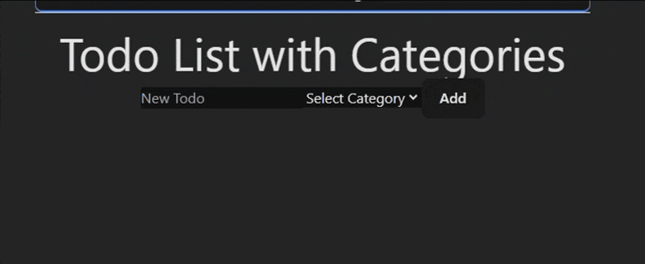

### Challenge: Todo List with Categories - Class Component

In this challenge, you will create a Todo List component called `TodoListWithCategories.jsx` that allows users to add and remove items from a list, with each item associated with a category fetched from a server.

#### Requirements:
1. The component should be a class component.
2. The component should have an input field for the new todo item.
3. The component should have a dropdown to select a category for the new todo item.
4. The component should have an "Add" button that adds the new item to the list.
5. The list should display all todo items with their associated categories.
6. Each item in the list should have a "Remove" button that removes the item from the list.

#### Server Endpoint:
- The server provides a list of categories at the endpoint `http://localhost:3000/categories`, you need to run the next command inside the server folder
```
node server.js
```

### Example



### Challenge: Todo List with Categories - Functional Component

In this challenge, you will create a Todo List component called `TodoListWithCategoriesFunctional.jsx` that allows users to add and remove items from a list, with each item associated with a category fetched from a server.

#### Requirements:
1. The component should be a class component.
2. Use the `useEffect` hook to fetch categories from the server.
3. Use a custom hook to encapsulate the logic for fetching categories.
4. The component should have an input field for the new todo item.
5. The component should have a dropdown to select a category for the new todo item.
6. The component should have an "Add" button that adds the new item to the list.
7. The list should display all todo items with their associated categories.
8. Each item in the list should have a "Remove" button that removes the item from the list.

#### Server Endpoint:
- The server provides a list of categories at the endpoint `http://localhost:3000/categories`, you need to run the next command inside the server folder
```
node server.js
```

### Example

